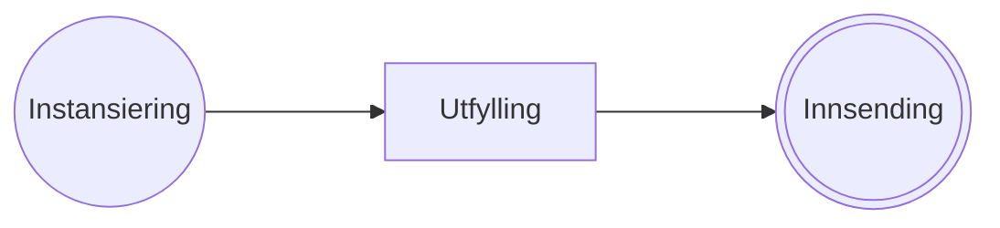

# Om applikasjonen

<!-- Her kan du legge inn en beskrivelse av applikasjonen. -->

## Egenskaper

<!--  -->

| Egenskap                            | Verdi                              |
| ----------------------------------- | ---------------------------------- |
| Migrering eller ny tjeneste?        | _TBD (Migrering/Ny)_               |
| Figma skisse                        | _TBD (J/N – legg til Figma lenke)_ |
| Språk                               | _TBD_                              |
| API                                 | _TBD_                              |
| eFormidling                         | _TBD (J/N)_                        |
| Frontend skal låses før produksjon? | _TBD (J/N)_                        |

### Lenker

#### Altinn 2

<!-- Denne tabellen fjernes dersom det er en ny tjeneste. -->

| Område            | Lenke |
| ----------------- | ----- |
| Skjemakatalogen   |       |
| TUL               |       |
| Altinn 2.0 (test) |       |

#### Altinn 3

| Område            | Lenke |
| ----------------- | ----- |
| Altinn Studio     |       |
| Altinn 3.0 (test) |       |

### Sikkerhetsinnstillinger

| Egenskap                                      | Verdi                                                                                 |
| --------------------------------------------- | ------------------------------------------------------------------------------------- |
| PartyTypesAllowed                             | bankruptcyEstate, organisation, person, subUnit (ta vekk de som ikke skal ha tilgang) |
| Sikkerhetsnivå                                | _TBD_                                                                                 |
| Automatisk sletting etter innsending          | true/false                                                                            |
| Skjul i arkivet til brukeren etter innsending | true/false                                                                            |
| Brukeren kan kopiere eksemplaret              | true/false                                                                            |
| Vis eksemplarer som er startet på             | true/false                                                                            |

### Roller

<!-- Legg til rollene og evt. steg de skal ha rettigheter på. -->

| Prosess steg       | Rolle kode | Les | Skriv | Bekreft | Betal | Avslå | Signer |
| ------------------ | ---------- | --- | ----- | ------- | ----- | ----- | ------ |
| Task_1 - Utfylling |            |     |       |         |       |       |        |
|                    |            |     |       |         |       |       |        |
| Task_2 - Signer 1  |            |     |       |         |       |       |        |
|                    |            |     |       |         |       |       |        |
| Task_3 - Signer 2  |            |     |       |         |       |       |        |
|                    |            |     |       |         |       |       |        |

### Prosess steg

<!-- Se [mermaid sin dokumentasjon](https://mermaid.js.org/syntax/flowchart.html) for oppsett av prosessen. -->



### Vedlegg

<!-- Her kan du legge ved informasjon om vedleggene i skjemaet. -->

| ID  | [allowedContentTypes](https://developer.mozilla.org/en-US/docs/Web/HTTP/MIME_types/Common_types) | maxSize | minCount | maxCount |
| --- | ------------------------------------------------------------------------------------------------ | ------- | -------- | -------- |
|     |                                                                                                  |         |          |          |

## Huskeliste

- [ ] Legg til følgende kode i `.gitignore`:
  ```
  # Do not include secrets.json file
  secrets.json
  ```
